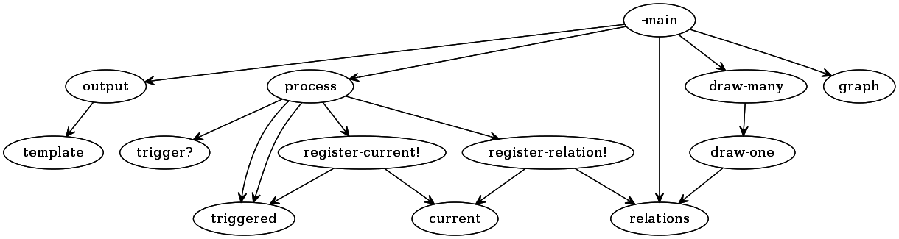

# codegraph

Generates a dot file based on your Clojure/ClojureScript code.

## Installation

`git clone https://gitlab.com/200ok/codegraph.git`

## Usage

    $ lein run <path-to-clj-file>

## Options

None.

## Examples

Spoiler: Running codegraph on itself will give you this...

### Bugs

`(or :bugfree :plenty)`

## License

Copyright © 2016 phil@200ok.ch

Distributed under the Eclipse Public License either version 1.0 or (at
your option) any later version.
